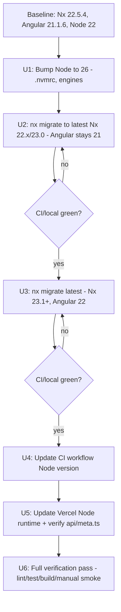

# feat: Migrate to Angular 22 (via Nx) and Node.js 26

## Summary

Upgrade the Nx workspace from Angular 21.1.6 / Nx 22.5.4 / Node 22 to Angular 22 (latest stable, released June 2026) and Node.js 26 (the upcoming Active LTS line, promoted from Current on 2026-10-28). Angular 22 requires Nx ≥23.1, so this is a two-hop migration: Nx 22 → Nx 23.1+ first (bringing Angular along to 21 if needed), then Nx/Angular → 22 in a second `nx migrate` pass. Node must move to a version Angular 22 actually supports (`^22.22.3 || ^24.15.0 || ^26.0.0`) before the Angular bump lands, and CI plus the Vercel deploy pipeline must be updated to match, or the migration will pass locally and fail in CI/production.

**Scope:** only the version bumps required for Angular 22 + Nx 23.1+ + Node 26 compatibility (TypeScript, angular-eslint, build/test tooling versions Nx's own migrations mandate). No proactive bump of unrelated devDependencies, no new features, no refactors beyond what codemods produce.

## Problem Frame

The workspace (`apps/rayms-website`, libs `invitations` and `poymoys-and-dragons`, plus a Vercel serverless function in `api/meta.ts`) is pinned to Angular 21.1.6 and Nx 22.5.4, on Node 22 (`.nvmrc`) with CI still running Node 20 (`.github/workflows/ci.yml`). The user wants to move to the latest stable Angular (v22) through Nx's own migration tooling, and to the latest LTS-track Node (v26), keeping the two changes compatible with each other.

## Requirements

- R1: `@angular/*` packages, `@angular-devkit/*`, `@schematics/angular`, and `angular-eslint` upgraded to their Angular-22-compatible versions.
- R2: Nx workspace (`nx`, `@nx/angular`, `@nx/eslint`, `@nx/js`, `@nx/vite`, `@nx/vitest`, `@nx/web`, `@nx/workspace`) upgraded to ≥23.1, run through `nx migrate` (not manual `package.json` edits) so codemods apply.
- R3: Node.js runtime upgraded to 26.x everywhere the version is pinned: `.nvmrc`, CI (`actions/setup-node`), and the Vercel project's Node runtime setting.
- R4: `npm run build`, `npm run build:prod`, `npm test`, and `nx run-many -t lint test build` all pass post-migration.
- R5: The Vercel deployment (`vercel.json`, `api/meta.ts` using `@vercel/node`) continues to build and serve correctly under Node 26.
- R6: No behavioral change to app functionality — this is a dependency/tooling migration, not a feature change.

## Key Technical Decisions

**KTD1 — Two-hop Nx migration, not a single jump.** Nx 22.5.4 caps Angular support at v21; Angular 22 requires Nx ≥23.1 (source: Nx 23.1 release notes). Running `nx migrate latest` directly from 22.5.4 risks an inconsistent intermediate state. Instead: (1) `nx migrate` to the latest Nx 22.x/23.0 patch compatible with current Angular 21, verify green, commit; (2) `nx migrate latest` again to reach Nx ≥23.1 + Angular 22, verify green, commit. Two checkpoints make bisecting a failure trivial.

**KTD2 — Node 26, per explicit user choice, with the LTS-timing caveat recorded.** Node 26 is "Current" (not yet Active LTS — that happens 2026-10-28) at the time this plan is written. The user explicitly chose Node 26 over Node 24 (the presently-Active LTS) knowing this. Angular 22 GA supports `^26.0.0`, so it's a compatible pairing. Recorded as a risk (see Risks) rather than silently downgraded to Node 24.

**KTD3 — Let `nx migrate --run-migrations` drive dependency versions; don't hand-pick versions.** Nx's migration generators pin the exact compatible versions of `@nx/*`, `@angular/*`, TypeScript, and `angular-eslint` for each target release. Manually editing `package.json` versions bypasses the codemods those migrations run (e.g. schema updates to `project.json`, `angular.json` equivalents, ESLint flat config changes) and is a common source of "works on paper, breaks at runtime" migration bugs.

**KTD4 — CI Node version and Vercel Node runtime are updated in the same change, not deferred.** Angular 22 does not run on Node 20 (CI's current pin) or Node 22 below patch `22.22.3`. Leaving CI/deploy config behind means the migration compiles locally but fails the first push. Per user confirmation, this is in scope (see origin: user Q&A during planning).

## High-Level Technical Design



---

## Scope Boundaries

**In scope:** Angular 21→22, Nx 22.5.4→≥23.1 and whatever Nx/Angular-mandated dependency bumps come with it (TypeScript, angular-eslint, `@angular-devkit/*`, build/test executors), Node 22→26 across `.nvmrc`/CI/Vercel.

**Out of scope / Deferred to Follow-Up Work:**
- Proactive upgrades to devDependencies not required by the Angular/Nx compatibility matrix (e.g. Vite, Vitest, Prettier, ESLint core bumped only if Nx's migration requires it, not opportunistically).
- Any application feature work, refactors, or new Angular 22 APIs (Signal Forms, `resource()`/`httpResource()`, `@Service` decorator, `injectAsync`) beyond what `ng update` codemods apply automatically.
- Migrating away from `zone.js` / adopting zoneless change detection (a separate, larger decision not implied by this request).
- Node 27 / the annual-release-model transition (out of scope — Node 27 doesn't exist until April 2027).

## Implementation Units

### U1. Bump Node.js version pin to 26

**Goal:** Move the workspace's declared Node version to 26.x before touching Angular/Nx, so subsequent migration steps run under the target runtime from the start.

**Requirements:** R3

**Dependencies:** none

**Files:**
- `.nvmrc`
- `package.json` (add/update an `engines.node` field if introducing one is consistent with repo conventions — check current absence first)

**Approach:** Install Node 26 locally (via nvm/fnm per `.nvmrc`), update `.nvmrc` to `26`, reinstall `node_modules` (`rm -rf node_modules && npm ci --legacy-peer-deps`, matching the existing CI install flags) to confirm no native/postinstall breakage under Node 26 before starting the Nx migration.

**Patterns to follow:** Existing `.nvmrc` is a single version string (`v22`); keep the same format.

**Test scenarios:**
- Happy path: `node -v` reports 26.x after switching; `npm ci --legacy-peer-deps` completes without errors.
- Error path: if any dependency's `engines` field rejects Node 26 (npm warns/errors), capture the offending package and confirm it's resolved by the later Nx/Angular bump (U2/U3) rather than needing a separate fix.
- Test expectation: none beyond install success — this unit changes tooling pins, not application behavior.

**Verification:** `npm ci --legacy-peer-deps` and `nx run-many -t lint test build` succeed under Node 26 with the *existing* Angular 21/Nx 22 dependency set.

---

### U2. First Nx migration hop: latest Nx 22.x/23.0 (Angular stays 21)

**Goal:** Move Nx forward to the newest release still compatible with Angular 21, establishing a clean intermediate checkpoint before the Angular-22-forcing jump.

**Requirements:** R2

**Dependencies:** U1

**Files:** `package.json`, `package-lock.json`, `nx.json`, `apps/rayms-website/project.json`, `libs/*/project.json`, any files touched by generated migrations (Nx writes a `migrations.json` transiently during the run)

**Approach:** Run `npx nx migrate 23.0` (or the newest 22.x/23.0 patch that still lists Angular 21 as supported — confirm the exact target version against Nx's release notes at execution time, since exact patch numbers shift). Review the generated migration list before applying, then `npx nx migrate --run-migrations`. Resolve any peer-dependency conflicts with `--legacy-peer-deps` consistent with CI's existing install flag.

**Execution note:** Commit this checkpoint separately from U3 so a failure in the Angular-22 hop can be isolated by diffing against this commit.

**Patterns to follow:** CI already uses `npm ci --legacy-peer-deps` (`.github/workflows/ci.yml`), so use the same flag locally to reproduce CI's resolution behavior.

**Test scenarios:**
- Happy path: `nx run-many -t lint test build` passes with Angular still at 21.x and Nx at the new intermediate version.
- Integration scenario: `apps/rayms-website` still builds via `@angular/build:application` executor (confirm the executor name/config wasn't renamed by this hop's migrations — check `apps/rayms-website/project.json` diff).
- Error path: if a migration script fails partway, confirm `git status` / `git diff` before retrying — Nx migrations are not always idempotent to re-run blindly.

**Verification:** `nx run-many -t lint test build` green; `git diff` reviewed for unexpected config rewrites; commit created.

---

### U3. Second Nx migration hop: latest (Nx ≥23.1, Angular 22)

**Goal:** Complete the migration to Angular 22 and Nx ≥23.1, applying all accompanying codemods (angular-eslint config, TypeScript version, build executor options).

**Requirements:** R1, R2

**Dependencies:** U2

**Files:** `package.json`, `package-lock.json`, `nx.json`, `eslint.config.mjs`, `apps/rayms-website/project.json`, `apps/rayms-website/tsconfig*.json`, `libs/*/project.json`, `tsconfig.base.json`

**Approach:** Run `npx nx migrate latest`, review the migration list (expect angular-eslint bump, TypeScript 6.x bump, possible `@angular/build:application` option changes for OnPush-by-default component generation), then `npx nx migrate --run-migrations`. Pay particular attention to any codemod touching `zone.js` polyfill wiring (`apps/rayms-website/project.json` → `polyfills: ["zone.js"]`) since Angular 22 keeps zone.js as an option but changes some defaults.

**Technical design (directional):**
```
nx migrate latest
  -> review migrations.json
  -> nx migrate --run-migrations
  -> resolve peer conflicts (npm install --legacy-peer-deps)
  -> re-run codemods' TODOs if any are left as manual markers
```

**Patterns to follow:** Same install-flag convention as U2.

**Test scenarios:**
- Happy path: full `nx run-many -t lint test build` passes on Angular 22 / Nx ≥23.1.
- Edge case: OnPush becoming the default change-detection strategy for newly-generated components (Angular 22 feature) does not retroactively change existing components' explicit `changeDetection` settings — verify no unexpected rendering behavior in `apps/rayms-website` by manually smoke-testing the app (`nx serve rayms-website`) against its key routes (home, `/expedition-33`, `/invitations/*`, `poymoys-and-dragons`).
- Integration scenario: `libs/invitations` and `libs/poymoys-and-dragons` still resolve via their `tsconfig.base.json` path mappings after the TypeScript version bump.
- Error path: if `angular-eslint` config format changed incompatibly with the existing `eslint.config.mjs`, confirm the migration's codemod updated it; if not, manually reconcile against angular-eslint's Angular-22-era docs.

**Verification:** `nx run-many -t lint test build` green on Node 26 + Angular 22 + Nx ≥23.1; manual `nx serve rayms-website` smoke test of each route confirms no visual/functional regression.

---

### U4. Update CI workflow to Node 26

**Goal:** Keep CI able to actually build/test/lint the upgraded workspace — CI is currently pinned to Node 20, which Angular 22 does not support at all.

**Requirements:** R3, R4

**Dependencies:** U3 (so CI is updated once the target dependency set is known-working locally)

**Files:** `.github/workflows/ci.yml`

**Approach:** Change the `actions/setup-node@v4` step's `node-version` from `20` to `26`. Keep the existing `cache: 'npm'` and `npm ci --legacy-peer-deps` install step unchanged unless the Angular 22 migration removed the need for `--legacy-peer-deps` (check peer-dependency warnings from U3; only drop the flag if npm install is clean without it).

**Patterns to follow:** Existing single-job CI structure (`.github/workflows/ci.yml`) — this is a one-line version bump plus a possible flag removal, not a workflow restructure.

**Test scenarios:**
- Happy path: a CI run on a branch with this change completes `lint`, `test`, and `build` successfully under Node 26.
- Test expectation: none beyond the CI run itself — this unit has no unit-testable logic, only pipeline configuration.

**Verification:** Push the branch and confirm the GitHub Actions run for `nx run-many -t lint test build` succeeds end-to-end.

---

### U5. Update Vercel deploy runtime and verify the serverless function

**Goal:** Ensure the production deploy path (Vercel) uses a Node runtime compatible with Angular 22's build output and the `@vercel/node`-based `api/meta.ts` function.

**Requirements:** R3, R5

**Dependencies:** U3

**Files:** `vercel.json`, `package.json` (`@vercel/node` version, if Vercel's Node 26 support requires a bump), `api/meta.ts` (verify only — no functional change expected)

**Approach:** Set the Vercel project's Node.js version (via Vercel dashboard project settings or a `"nodejs" ` engine field, per Vercel's current configuration method — confirm exact mechanism at execution time since Vercel's runtime-selection UI/config has changed across their releases) to 26.x. Confirm `@vercel/node`'s installed version supports being invoked under a Node 26 function runtime; bump only if required for compatibility (per KTD3/scope boundary — no proactive bump).

**Test scenarios:**
- Happy path: `npm run build:prod` produces `dist/apps/rayms-website/browser` as `vercel.json`'s `outputDirectory` expects, unchanged in shape from the pre-migration build.
- Integration scenario: `api/meta.ts`'s crawler-detection rewrites (`vercel.json` → `/expedition-33`, `/invitations/*` with bot user-agent matching) still return correct meta tags when the function runs under Node 26 — verify with `scripts/test-api.sh` and `scripts/test-social-crawlers.sh` against a preview deployment.
- Error path: if `@vercel/node`'s type definitions (`VercelRequest`, `VercelResponse` imports in `api/meta.ts`) become incompatible with the new TypeScript version from U3, resolve via a version bump scoped narrowly to `@vercel/node`.

**Verification:** A Vercel preview deployment for this branch builds successfully and `scripts/test-social-crawlers.sh` / `scripts/test-api.sh` against the preview URL return expected meta tags for `/expedition-33` and `/invitations/*`.

---

### U6. Full verification pass

**Goal:** Confirm the whole migration (Node 26 + Nx ≥23.1 + Angular 22 + CI + Vercel) holds together as one coherent, deployable state.

**Requirements:** R4, R5, R6

**Dependencies:** U1, U2, U3, U4, U5

**Files:** none (verification only)

**Approach:** Run the full local and CI pipelines, plus a manual pass over the app's routes, as the final gate before considering the migration complete.

**Test scenarios:**
- Happy path: `nx run-many -t lint test build` green locally and in CI; `nx serve rayms-website` manual smoke test of all routes (home, `/expedition-33`, `/invitations/*`, poymoys-and-dragons feature) shows no regressions.
- Integration scenario: a full Vercel preview deploy from the migration branch succeeds and serves correctly, including the crawler meta-tag rewrite paths.
- Test expectation: this unit re-runs existing suites; it does not add new test files.

**Verification:** Green CI run on the migration branch; successful Vercel preview deploy; manual smoke test checklist (home, expedition-33, invitations, poymoys-and-dragons, crawler meta endpoints) all pass.

---

## Risks & Dependencies

- **Risk: Node 26 is not yet Active LTS at plan time** (promotion scheduled 2026-10-28). If this migration lands before that date, the workspace runs on a still-"Current" Node line rather than a promoted-LTS one. Mitigation: this was an explicit, informed user choice; Angular 22 GA officially supports `^26.0.0`, so there's no compatibility risk — only a "not technically LTS yet" timing note worth surfacing to whoever deploys this.
- **Risk: exact Nx intermediate version drifts.** U2 names "latest Nx 22.x/23.0" directionally; the precise version compatible with Angular 21 should be confirmed against Nx's release notes at execution time rather than hardcoded now, since Nx ships frequent patch releases.
- **Dependency: `@vercel/node` and Vercel's platform-level Node 26 support.** If Vercel's platform doesn't yet offer Node 26 as a selectable function runtime at execution time, U5 may need to temporarily target Node 24 for the *Vercel function only* while the rest of the workspace (build tooling, CI) runs Node 26 — flag this to the user if it's discovered mid-implementation rather than silently downgrading the whole plan.
- **Risk: `--legacy-peer-deps` masking a real incompatibility.** The existing CI/install flow already uses `--legacy-peer-deps`; carrying it through the migration is consistent with current practice but could hide a genuine peer-dependency conflict introduced by the Angular 22 bump. Worth a clean-install sanity check (without the flag) at least once during U3 to see what it's suppressing.

## Sources & Research

- Angular 22 stable release: June 3, 2026 ([blog.angular.dev](https://blog.angular.dev/announcing-angular-v22-c52bb83a4664)).
- Angular 22 Node.js support range `^22.22.3 || ^24.15.0 || ^26.0.0`, Node 20 dropped entirely.
- Nx 23.1 release notes: Angular 22 support requires Nx ≥23.1; `nx migrate latest` / `nx migrate --run-migrations` is the supported upgrade path ([nx.dev/blog/nx-23-1-release](https://nx.dev/blog/nx-23-1-release)).
- Node.js LTS status as of plan date (2026-09-09): Node 24 Active LTS, Node 22 Maintenance LTS, Node 26 Current (becomes Active LTS 2026-10-28) ([endoflife.date/nodejs](https://endoflife.date/nodejs)).
