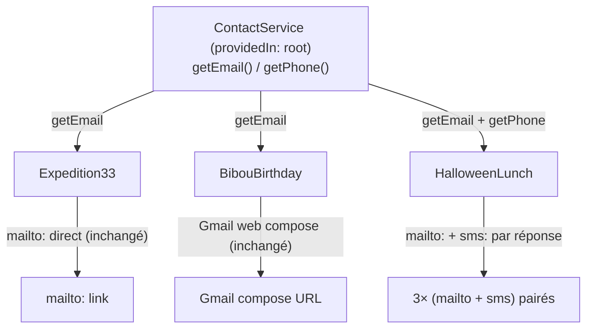

# feat: Invitation Halloween — déjeuner déguisé horreur-comique

## Summary

Ajoute une nouvelle invitation Angular `HalloweenLunch` dans `libs/invitations`, sur le modèle de `libs/invitations/src/lib/expedition-33`, pour un déjeuner déguisé le samedi 31 octobre 2026 à midi. En parallèle, extrait la logique d'offuscation de contact (email en base64, désormais aussi téléphone en fragments JS) dans un service partagé `ContactService`, consommé par les trois invitations (`expedition-33`, `bibou-birthday`, `halloween-lunch`) sans changement de comportement visible pour les deux premières.

(see origin: docs/brainstorms/2026-09-09-halloween-lunch-invitation-requirements.md)

---

## Problem Frame

`expedition-33` et `bibou-birthday` dupliquent chacune leur propre `atob('...')` pour l'email de contact. Ajouter une troisième invitation avec, en plus, un numéro de téléphone à protéger contre le spam, dupliquerait encore cette logique. `libs/invitations` n'a par ailleurs aucune infrastructure de test aujourd'hui (`libs/invitations/project.json` n'a qu'une cible `lint`) — un prérequis pour vérifier que la migration des deux invitations existantes ne change rien à leur comportement observable.

Le mail ne s'ouvrant pas de façon fiable sur tous les téléphones, la nouvelle invitation ajoute un canal SMS pré-rempli par réponse RSVP, avec un numéro reconstruit en JS (jamais en clair).

---

## Key Technical Decisions

- **Gabarit visuel : `bibou-birthday`, pas `expedition-33`.** Le composant `HalloweenLunch` reprend la structure visuelle de `bibou-birthday` (bannière photo pleine largeur en haut de page, corps sur fond dégradé animé, sections en cartes semi-transparentes) plutôt que le fond plein-écran d'`expedition-33`. `haunted_house.jpg` est utilisée comme image de bannière (`` en haut), pas comme `background-image` CSS. La structure de classe TypeScript (`onRsvp`, `addToCalendar`, liens Maps/Cosplay) reste calquée sur `expedition-33` — seul le gabarit `.html`/`.scss` change de référence (voir U4).
- **Service `ContactService` (`providedIn: 'root'`), pas de refonte des mécanismes RSVP existants.** Il expose uniquement les valeurs décodées (`getEmail(): string`, `getPhone(): string`) — synchrones, pas d'`Observable`/`Promise`. `expedition-33` garde son `mailto:` direct, `bibou-birthday` garde son URL Gmail web ; seule la source de la valeur change. Cela respecte la contrainte R13 de zéro changement visible sans forcer une unification des styles de lien que le brainstorm n'a pas demandée.
- **Offuscation téléphone par fragments, pas par `atob`.** Conformément à R10, un algorithme dédié assemble le numéro à partir de plusieurs segments de chaîne (ex. tableau de fragments réassemblés puis formatés), distinct de l'approche email. Même limite intrinsèque que le base64 (réversible par un humain déterminé lisant le bundle JS) — accepté comme "suffisant contre le scraping automatisé", au même niveau d'exigence que l'email existant.
- **Format international pour le numéro (`+33...`).** Nécessaire pour que le schéma `sms:` résolve correctement le destinataire sur iOS et Android.
- **Séparateur `sms:` sensible à la plateforme.** iOS attend `sms:+33...&body=...`, Android attend historiquement `sms:+33...?body=...`. Le service ou le composant détecte la plateforme (`navigator.userAgent`) pour choisir le bon séparateur, afin que le pré-remplissage fonctionne sur les deux OS — cohérent avec l'exigence Android ajoutée après coup sur le calendrier, appliquée ici par cohérence même si R11 ne mentionne qu'iPhone.
- **Contenu du SMS : version courte du mail, pas un simple lien vers le mail.** Le corps du SMS reprend la réponse et la date dans un format bref (budget de longueur d'URL encodée plus restreint que le mail) ; le texte exact est un détail de copywriting laissé à l'implémentation (voir Deferred to Follow-Up Work).
- **Bootstrap de l'infrastructure de test pour `libs/invitations`.** Ajout d'une cible `test` (`@nx/vitest:test`) et des fichiers de config Vite/tsconfig associés, en miroir de `apps/rayms-website`. Nécessaire pour couvrir `ContactService` et verrouiller la non-régression d'`expedition-33`/`bibou-birthday` pendant la migration — aucune suite de tests n'existe aujourd'hui dans ce lib.
- **Structured data : nouvelle méthode dédiée, pas de généralisation de l'existant.** `StructuredDataService.addEventStructuredData()` est aujourd'hui codé en dur pour Expedition 33 (y compris un `eventAttendanceMode: OnlineEventAttendanceMode` qui semble erroné pour un événement physique). Plutôt que de généraliser cette méthode (risque de régression sur du code non testé), on ajoute une méthode séparée `addHalloweenLunchEventStructuredData()` suivant le même moule que le pattern par-route de `MetaService` (`setXMeta()`), avec `OfflineEventAttendanceMode` et `startDate` corrects pour ce nouveau contenu uniquement. Le contenu existant d'Expedition 33 n'est pas touché (voir Scope Boundaries).
- **Route visible dans la navigation**, comme `expedition-33` (décision utilisateur), donc **non ajoutée** à `hiddenRoutes` dans `apps/rayms-website/src/app/app.ts`, et elle reçoit des balises meta + structured data (contrairement à `bibou-birthday`, qui est cachée et n'a pas de structured data).
- **`bibou-birthday.sendSms()` reste inchangé au mot près.** Le placeholder actuel (`alert(...)`) n'est pas branché sur le nouveau `getPhone()` — R15 exclut explicitement un bouton SMS réel pour cette invitation.

---

## Requirements

Traçabilité vers `docs/brainstorms/2026-09-09-halloween-lunch-invitation-requirements.md` : R1-R11 (invitation Halloween), R12-R15 (service partagé) — toutes couvertes par les unités ci-dessous.

---

## Output Structure

Nouveaux fichiers dans `libs/invitations` :

```text
libs/invitations/
├── project.json                         (modifié — ajout cible `test`)
├── vite.config.mts                      (nouveau)
├── tsconfig.spec.json                   (nouveau)
├── src/
│   ├── index.ts                         (modifié — nouveaux exports)
│   ├── test-setup.ts                    (nouveau)
│   └── lib/
│       ├── services/
│       │   ├── contact.service.ts       (nouveau)
│       │   └── contact.service.spec.ts  (nouveau)
│       ├── expedition-33/
│       │   ├── expedition-33.ts         (modifié — migration email)
│       │   └── expedition-33.spec.ts    (nouveau)
│       ├── bibou-birthday/
│       │   ├── bibou-birthday.ts        (modifié — migration email)
│       │   └── bibou-birthday.spec.ts   (nouveau)
│       └── halloween-lunch/
│           ├── halloween-lunch.ts       (nouveau)
│           ├── halloween-lunch.html     (nouveau)
│           ├── halloween-lunch.scss     (nouveau)
│           └── halloween-lunch.spec.ts  (nouveau)
```

---

## High-Level Technical Design



Pré-remplissage SMS par plateforme (à l'intérieur de `HalloweenLunch` ou de `ContactService`, décision d'implémentation) :

```text
buildSmsLink(phone, body):
  separator = isAndroidUA(navigator.userAgent) ? '?' : '&'
  return `sms:${phone}${separator}body=${encodeURIComponent(body)}`
```

Directionnel — l'implémenteur peut affiner la détection de plateforme (ex. fallback si `userAgent` est absent) sans changer l'approche.

---

## Implementation Units

### U1. Bootstrap de l'infrastructure de test pour `libs/invitations`

**Goal:** Donner à `libs/invitations` une cible `test` Vitest fonctionnelle, prérequis pour tester `ContactService` et les migrations U2-U3.

**Requirements:** Prérequis technique (aucun R-ID direct — infrastructure nécessaire à la vérifiabilité des autres unités).

**Dependencies:** Aucune.

**Files:**
- `libs/invitations/project.json` (modifier — ajouter la cible `test`)
- `libs/invitations/vite.config.mts` (créer, miroir de `apps/rayms-website/vite.config.mts`)
- `libs/invitations/tsconfig.spec.json` (créer, miroir de `apps/rayms-website/tsconfig.spec.json`)
- `libs/invitations/src/test-setup.ts` (créer, identique à `apps/rayms-website/src/test-setup.ts`)

**Approach:** Copier le pattern `@nx/vitest:test` + `@analogjs/vite-plugin-angular` déjà utilisé par `apps/rayms-website`. `reportsDirectory` pointant vers `coverage/libs/invitations`. `include` sur `src/lib/**/*.spec.ts`.

**Patterns to follow:** `apps/rayms-website/vite.config.mts`, `apps/rayms-website/project.json` (cible `test`), `apps/rayms-website/tsconfig.spec.json`, `apps/rayms-website/src/test-setup.ts`.

**Test scenarios:**
Test expectation: none -- configuration pure, aucune logique métier ; la vérification se fait via U2 (premier test réel qui doit s'exécuter avec succès).

**Verification:** Une commande de test Nx sur le projet `invitations` s'exécute et découvre au moins un fichier spec (ajouté en U2) sans erreur de configuration.

---

### U2. `ContactService` partagé (email + téléphone offusqués)

**Goal:** Centraliser l'email (base64) et le téléphone (fragments) dans un service unique injectable, remplaçant la duplication actuelle.

**Requirements:** R12, R10 (mécanisme d'offuscation du téléphone).

**Dependencies:** U1 (infrastructure de test).

**Files:**
- `libs/invitations/src/lib/services/contact.service.ts` (créer)
- `libs/invitations/src/lib/services/contact.service.spec.ts` (créer)
- `libs/invitations/src/index.ts` (modifier — exporter le service si consommé hors du lib, sinon garder interne selon besoin de U4)

**Approach:** `@Injectable({ providedIn: 'root' })`. `getEmail()` retourne `atob('cmVteS5sYWZmdWdlQGdtYWlsLmNvbQ==')` (valeur identique à l'existant). `getPhone()` reconstruit le numéro à partir d'un tableau de fragments de chaîne (ex. segments de 2-3 caractères) concaténés à l'exécution, formaté en `+33XXXXXXXXX`. Les deux méthodes sont synchrones et pures (pas d'état mutable, pas de cache nécessaire vu la taille triviale du calcul).

**Technical design:**
```text
class ContactService:
  private readonly emailFragments = ...  # base64, comme aujourd'hui
  private readonly phoneFragments: string[] = [ ... ]  # fragments choisis à l'implémentation

  getEmail(): string  -> atob(emailFragments)
  getPhone(): string  -> phoneFragments.join('')  # format +33XXXXXXXXX
```
Directionnel — le découpage exact des fragments téléphone (nombre de segments, ordre) est un détail d'implémentation à choisir pour l'obfuscation, pas une spécification figée.

**Patterns to follow:** `libs/poymoys-and-dragons/src/lib/services/campaign.service.ts` (convention `providedIn: 'root'` dans un lib), `libs/invitations/src/lib/expedition-33/expedition-33.ts:14` (pattern `atob` actuel).

**Test scenarios:**
- Happy path : `getEmail()` retourne exactement `'remy.laffuge@gmail.com'`.
- Happy path : `getPhone()` retourne une chaîne au format `+33` suivi de 9 chiffres, sans espace ni séparateur.
- Edge case : le numéro reconstruit ne contient jamais de fragment brut identifiable en clair dans le code source du fichier compilé de test (vérifie que la reconstruction dépend bien de la concaténation, pas d'une constante directe).
- Intégration : le service est bien résolu comme singleton (`TestBed.inject(ContactService)` retourne la même instance dans deux résolutions successives).

**Verification:** Les tests `contact.service.spec.ts` passent ; `getEmail()`/`getPhone()` renvoient les valeurs attendues.

---

### U3. Migration de `expedition-33` et `bibou-birthday` vers `ContactService`

**Goal:** Remplacer l'`atob` local dans chacun des deux composants par un appel à `ContactService.getEmail()`, sans changement de comportement observable.

**Requirements:** R13, R15.

**Dependencies:** U2.

**Files:**
- `libs/invitations/src/lib/expedition-33/expedition-33.ts` (modifier)
- `libs/invitations/src/lib/expedition-33/expedition-33.spec.ts` (créer)
- `libs/invitations/src/lib/bibou-birthday/bibou-birthday.ts` (modifier)
- `libs/invitations/src/lib/bibou-birthday/bibou-birthday.spec.ts` (créer)

**Approach:** Dans chaque composant, remplacer `private readonly emailAddress = atob(...)` par `private readonly contactService = inject(ContactService); private readonly emailAddress = this.contactService.getEmail();` (ou lecture directe dans `onRsvp()`/`addToCalendar()` sans champ intermédiaire — au choix de l'implémentation tant que la valeur reste identique). Aucune autre ligne de `onRsvp()`, `addToCalendar()`, ou des templates ne change.

**Execution note:** Ajouter d'abord un test de non-régression capturant l'URL `mailto:`/Gmail générée par `onRsvp('oui')` avec l'implémentation actuelle (avant migration), puis migrer et vérifier que le test passe toujours à l'identique — caractérisation avant modification, car aucun test n'existe aujourd'hui sur ces composants.

**Patterns to follow:** Structure de `apps/rayms-website/src/app/app.spec.ts` pour `TestBed.configureTestingModule` sur un standalone component.

**Test scenarios:**
- Happy path (`expedition-33`) : `onRsvp('oui')` ouvre une URL `mailto:` contenant `remy.laffuge@gmail.com` — identique caractère pour caractère à la valeur produite avant migration.
- Happy path (`bibou-birthday`) : `onRsvp('oui')` ouvre une URL Gmail web compose contenant `remy.laffuge@gmail.com` — identique à la valeur pré-migration.
- Intégration : `addToCalendar()` sur les deux composants continue d'inclure l'email dans la description de l'événement, valeur inchangée.
- Non-régression : `bibou-birthday.sendSms()` produit toujours exactement le même texte d'alerte qu'avant la migration (aucun branchement sur `ContactService.getPhone()`).

**Verification:** Les nouveaux specs passent ; aucune différence de comportement observable (URLs générées identiques) entre avant et après migration.

---

### U4. Composant `HalloweenLunch`

**Goal:** Créer le composant d'invitation Halloween complet (contenu, boutons Maps/Calendrier/Costumes, RSVP mail+SMS pairé).

**Requirements:** R1, R2, R3, R4, R5, R6, R7, R8, R9, R10, R11, R14.

**Dependencies:** U2 (ContactService).

**Files:**
- `libs/invitations/src/lib/halloween-lunch/halloween-lunch.ts` (créer)
- `libs/invitations/src/lib/halloween-lunch/halloween-lunch.html` (créer)
- `libs/invitations/src/lib/halloween-lunch/halloween-lunch.scss` (créer)
- `libs/invitations/src/lib/halloween-lunch/halloween-lunch.spec.ts` (créer)
- `libs/invitations/src/index.ts` (modifier — exporter `HalloweenLunch`)

**Approach:** Standalone component, `ChangeDetectionStrategy.OnPush`, sélecteur `lib-halloween-lunch`, structure calquée sur `expedition-33.ts`/`.html`/`.scss` :
- `partyDate = 'samedi 31 octobre 2026'`, `partyTime = '12h00'`, `address` identique à `expedition-33`.
- `googleMapsLink` identique à `expedition-33` (même adresse).
- `pinterestCosplayLink` / `instagramCosplayLink` : requêtes génériques horreur (ex. `horror%20costume%20ideas`, `halloween%20costume%20ideas`) plutôt que liées à une franchise.
- `addToCalendar()` : même mécanisme Google Calendar TEMPLATE que `expedition-33`/`bibou-birthday`, dates fixées au 31 octobre 2026 12h00–?.
- Texte : ton humoristique-horrifique, blague sur les 35 ans (dans l'esprit de "je n'ai encore que 32 ans"), justification comique du décalage horaire (midi à cause des enfants) — texte exact laissé à l'implémentation (voir Deferred to Follow-Up Work).
- RSVP : pour chacune des 3 réponses, une paire de boutons mail + SMS groupée par réponse (ex. bloc "✅ Oui" contenant deux boutons compacts ✉️/📱). `onRsvpMail(response)` reprend le pattern `expedition-33` (`mailto:` direct). `onRsvpSms(response)` construit un lien `sms:` avec séparateur dépendant de la plateforme (voir High-Level Technical Design) et un corps court dérivé de la même réponse.
- **Reprise du gabarit visuel de `bibou-birthday` plutôt que celui d'`expedition-33`** (décision utilisateur) : bannière photo pleine largeur en haut de page (`<div class="invitation-banner"></div>`), plutôt que l'image de fond plein-écran (`background-image` sur tout le container) utilisée par `expedition-33`. Le corps de la page utilise un fond en dégradé uni animé (façon `bibou-birthday.scss` `.invitation-container` / `gradientShift`), avec une palette adaptée au thème horreur (violet/noir/orange plutôt que bleu/orange spatial) au lieu de l'overlay posé sur l'image de fond d'`expedition-33`. Les sections de contenu (message principal, détails événement, RSVP) gardent le style "carte" semi-transparente + `backdrop-filter: blur` de `bibou-birthday.scss`, plus lisible par-dessus un fond dégradé qu'une photo.
- Responsive : boutons RSVP en paires compactes empilées verticalement sur mobile, cible tactile ≥44px par bouton (et non par paire), `aria-label` explicite sur chaque bouton icône-seule (ex. "Répondre oui par SMS") faute de libellé texte visible, pas de défilement horizontal (breakpoint desktop à 480px comme `bibou-birthday.scss`, plutôt que 768px).

**Technical design:**
```text
buildSmsLink(response, phone):
  body = shortRsvpMessage(response)  # texte bref, différent du corps mail
  separator = isAndroidUA() ? '?' : '&'
  return `sms:${phone}${separator}body=${encodeURIComponent(body)}`
```
Directionnel — `shortRsvpMessage` est un détail de copywriting, pas une spécification.

**Patterns to follow:** `libs/invitations/src/lib/bibou-birthday/bibou-birthday.html` (bannière photo `.invitation-banner`/`.banner-img`, structure de template : header, main-message, event-details, action-buttons, rsvp-section, footer), `libs/invitations/src/lib/bibou-birthday/bibou-birthday.scss` (fond dégradé animé, cartes semi-transparentes `backdrop-filter`, boutons `.btn`, breakpoint 480px), `libs/invitations/src/lib/expedition-33/expedition-33.ts` (structure de classe, `onRsvp`, `addToCalendar`, liens Maps/Cosplay — logique inchangée, seul le gabarit visuel change).

**Test scenarios:**
- Happy path : le composant se crée sans erreur (`TestBed.createComponent(HalloweenLunch)`).
- Happy path : `openGoogleMaps()` ouvre l'URL Maps attendue pour l'adresse `3 chemin d'En Fournes, 81470 Cambon-lès-Lavaur`.
- Happy path : `addToCalendar()` génère une URL Google Calendar TEMPLATE contenant la date du 31 octobre 2026.
- Happy path : pour chacune des 3 réponses (oui/non/peut-être), le mail RSVP (`onRsvpMail`) contient la réponse en majuscule et le corps pré-rempli.
- Happy path : pour chacune des 3 réponses, le lien SMS (`onRsvpSms`) contient le numéro reconstruit par `ContactService.getPhone()` et un corps pré-rempli.
- Edge case : le lien SMS utilise le séparateur `&` quand la plateforme détectée n'est pas Android (comportement iPhone par défaut).
- Edge case : le lien SMS utilise le séparateur `?` quand la plateforme détectée est Android.
- Edge case : le numéro de téléphone n'apparaît jamais en clair dans le template HTML rendu (vérifie l'absence de la chaîne littérale dans le DOM avant interaction).
- Intégration : `openCosplayIdeas()`/`openInstagramCosplay()` ouvrent des URLs de recherche génériques horreur (ne contiennent pas de nom de franchise).

**Verification:** Tous les specs `halloween-lunch.spec.ts` passent ; le composant s'affiche sans erreur de console dans un test de montage basique.

---

### U5. Wiring applicatif (route, meta, structured data)

**Goal:** Brancher `HalloweenLunch` dans l'application, en miroir exact du wiring `expedition-33` (route visible, meta dédiée, structured data dédiée).

**Requirements:** R1 (accessibilité de la page), Dépendances/Assumptions de l'origin doc (wiring applicatif suit le schéma `expedition-33`).

**Dependencies:** U4.

**Files:**
- `apps/rayms-website/src/app/app.routes.ts` (modifier — ajouter la route `halloween-lunch`)
- `apps/rayms-website/src/app/app.ts` (modifier — branche `updateMetaForRoute` ; **ne pas** ajouter `halloween-lunch` à `hiddenRoutes`)
- `apps/rayms-website/src/app/services/meta.service.ts` (modifier — ajouter `setHalloweenLunchMeta()`)
- `apps/rayms-website/src/app/services/structured-data.service.ts` (modifier — ajouter `addHalloweenLunchEventStructuredData()`, méthode séparée, sans toucher `addEventStructuredData()`)

**Approach:** Suivre exactement le schéma `expedition-33` :
1. Route `{ path: 'halloween-lunch', loadComponent: () => import('@rayms-website/invitations').then((m) => m.HalloweenLunch) }`.
2. `updateMetaForRoute` : nouvelle branche `else if (url.includes('halloween-lunch'))` appelant `setHalloweenLunchMeta()` **et** `addHalloweenLunchEventStructuredData()` (car route visible, contrairement à `bibou-birthday`).
3. `setHalloweenLunchMeta()` : titre/description sur le ton horreur-comique, `image` pointant vers `haunted_house.jpg` servi (`${siteConfig.url}/invitations/haunted_house.jpg`) ou `siteConfig.ogImage` selon préférence visuelle, `url: \`${siteConfig.url}/halloween-lunch\``.
4. `addHalloweenLunchEventStructuredData()` : nouvelle méthode dans `StructuredDataService`, structure Event schema.org avec `eventAttendanceMode: OfflineEventAttendanceMode` (corrigé pour ce nouveau contenu uniquement) et `startDate` renseigné (`2026-10-31T12:00:00`), sans modifier la méthode existante d'Expedition 33.

**Patterns to follow:** `apps/rayms-website/src/app/app.routes.ts` (entrée `expedition-33`), `apps/rayms-website/src/app/app.ts:48-57` (`updateMetaForRoute`), `apps/rayms-website/src/app/services/meta.service.ts:81-89` (`setExpedition33Meta`), `apps/rayms-website/src/app/services/structured-data.service.ts:19-38` (`addEventStructuredData`, comme squelette à copier plutôt qu'à réutiliser).

**Test scenarios:**
- Intégration : naviguer vers `/halloween-lunch` déclenche `setHalloweenLunchMeta()` et `addHalloweenLunchEventStructuredData()` (test sur `App` similaire à `apps/rayms-website/src/app/app.spec.ts`, en vérifiant le titre du document après navigation simulée, ou en espionnant les appels de service).
- Edge case : `halloween-lunch` n'apparaît pas dans `hiddenRoutes` — le sélecteur de routes (`loadAvailableRoutes`) inclut bien `halloween-lunch` dans `availableRoutes`.
- Non-régression : naviguer vers `/expedition-33` continue d'appeler uniquement `addEventStructuredData()` (pas la nouvelle méthode), comportement inchangé.

**Verification:** La route `/halloween-lunch` charge le composant en lazy-loading ; les balises meta et le script structured data apparaissent dans le head lors de la navigation vers cette route.

---

## Scope Boundaries

- Pas de franchise pop-culture précise pour le thème de déguisement (contrairement à `expedition-33`) — thème horreur générique.
- Pas de détection automatique de l'échec d'ouverture du `mailto:` — les boutons mail et SMS restent tous deux visibles en permanence, sans logique de fallback conditionnel.
- Pas d'ajout de bouton SMS sur `bibou-birthday` — son placeholder `sendSms()` reste inchangé au mot près.
- Pas de génération de fichier `.ics` téléchargeable — le lien Google Calendar existant couvre déjà iPhone et Android.
- Pas de correction du `eventAttendanceMode` ni ajout de `startDate` sur la structured data existante d'Expedition 33 — seule la nouvelle méthode pour Halloween lunch introduit ces champs corrects, pour éviter tout risque de régression sur du code non testé aujourd'hui.
- Pas d'unification du style de lien RSVP entre les invitations (`expedition-33` garde `mailto:` direct, `bibou-birthday` garde Gmail web compose) — seule la source de la valeur email est centralisée.

### Deferred to Follow-Up Work

- Texte exact des messages (RSVP mail/SMS, corps de page, blagues) — rédaction de copie assignée à l'implémentation, dans l'esprit du ton défini en Key Technical Decisions et dans le Problem Frame de l'origin doc.
- Découpage exact des fragments de reconstruction du numéro de téléphone (nombre de segments, ordre) — détail d'obfuscation laissé à l'implémentation.
- Fix du `eventAttendanceMode`/`startDate` manquant sur la structured data existante d'Expedition 33 (bug pré-existant identifié pendant la recherche, hors périmètre de cette invitation).

---

## Dependencies / Assumptions

- `libs/invitations/src/img/haunted_house.jpg` existe déjà dans le dépôt (confirmé) et est automatiquement servie sous `/invitations/haunted_house.jpg` via la configuration d'assets de `apps/rayms-website/project.json`.
- Le wiring applicatif suit le schéma déjà en place pour `expedition-33` (route, meta, structured data, export barrel) — confirmé par la recherche repo.
- `libs/invitations` n'a aujourd'hui aucune cible de test ni fichier de configuration Vitest — U1 les introduit comme prérequis, en miroir de la configuration `apps/rayms-website`.
- Le format international `+33` pour le numéro de téléphone est nécessaire pour la compatibilité `sms:` cross-plateforme.

---

## Sources & Research

- Recherche repo : structure de `libs/invitations`, pattern de duplication `atob` (`expedition-33.ts:14`, `bibou-birthday.ts:14`), conventions de service (`providedIn: 'root'`, précédent dans `libs/poymoys-and-dragons/src/lib/services/campaign.service.ts`), wiring applicatif (`app.routes.ts`, `app.ts`, `meta.service.ts`, `structured-data.service.ts`), conventions de test (Vitest + `@analogjs/vitest-angular`, aucun spec existant sous `libs/`).
- Analyse de flux : edge cases RSVP à 6 boutons, différences de séparateur `sms:` iOS/Android, risques de régression sur la migration du service de contact, lacunes de la structured-data actuelle (`eventAttendanceMode` incorrect, `startDate` manquant).
- Aucun répertoire `docs/solutions/` n'existe dans ce dépôt — aucun apprentissage institutionnel disponible pour cette zone.
